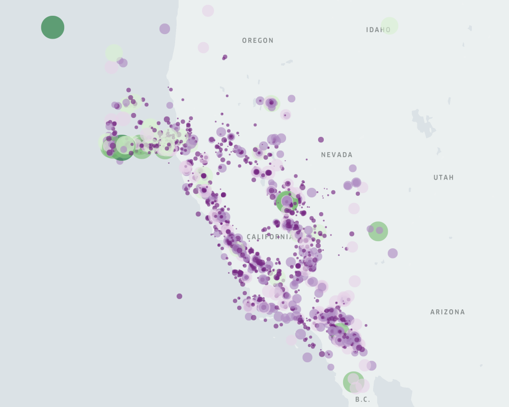

# KeplerGL.jl

[](https://jmboehm.github.io/KeplerGL.jl/dev/)
[](https://github.com/jmboehm/KeplerGL.jl/actions/workflows/ci.yml?query=branch%3Amain)
[](https://github.com/jmboehm/KeplerGL.jl/blob/main/LICENSE)
[](https://pkgs.genieframework.com?packages=KeplerGL)

<h3></h3>


Julia package to create, render, and export geospatial maps, using [Kepler.gl](http://kepler.gl), via [Blink.jl](https://github.com/JuliaGizmos/Blink.jl). 

Currently uses version 2.5.5 of Kepler.gl.

## Example

The following code produces a simple point map:

```julia
using KeplerGL, Colors, ColorBrewer

token = "<INSERT MAPBOX TOKEN HERE>"

m = KeplerGL.KeplerGLMap(token, center_map=false)
df = CSV.read("assets/example_data/data.csv", DataFrame)
KeplerGL.add_point_layer!(m, df, :Latitude, :Longitude,
    color = colorant"rgb(23,184,190)", color_field = :Magnitude, color_scale = "quantize", 
    color_range = ColorBrewer.palette("PRGn", 6),
    radius_field = :Magnitude, radius_scale = "sqrt", radius_range = [4.2, 96.2], radius_fixed = false,
    filled = true, opacity = 0.39, outline = false);
m.config[:config][:mapState][:latitude] = 38.32068477880718
m.config[:config][:mapState][:longitude]= -120.42806781055732
m.config[:config][:mapState][:zoom] = 4.886825331541375
m.window[:map_legend_show] = false
m.window[:map_legend_active] = false
m.window[:visible_layers_show] = false
m.window[:visible_layers_active] = false
win = KeplerGL.render(m);

# Exporting an image
KeplerGL.export_image(win, "assets/img/earthquakes.png")
```




## Layers

At this point the following layers are implemented:

- [Point Layers](https://jmboehm.github.io/KeplerGL.jl/dev/layers/#Point-Layers)
- [Polygon Layers](https://jmboehm.github.io/KeplerGL.jl/dev/layers/#Polygon-Layers)
- [Hexbin Layers](https://jmboehm.github.io/KeplerGL.jl/dev/layers/#Hexbin-Layers)
- [Line Layers](https://jmboehm.github.io/KeplerGL.jl/dev/layers/#Line-Layers)
- [Arc Layers](https://jmboehm.github.io/KeplerGL.jl/dev/layers/#Arc-Layers)
- [Grid Layers](https://jmboehm.github.io/KeplerGL.jl/dev/layers/#Grid-Layers)
- [Heatmap Layers](https://jmboehm.github.io/KeplerGL.jl/dev/layers/#Heatmap-Layers)
- [Cluster Layers](https://jmboehm.github.io/KeplerGL.jl/dev/layers/#Cluster-Layers)
- [Icon Layers](https://jmboehm.github.io/KeplerGL.jl/dev/layers/#Icon-Layers)
- [H3 Layers](https://jmboehm.github.io/KeplerGL.jl/dev/layers/#H3-Layers)

## Installation

To install the package, type in the Julia command prompt

```
] add https://github.com/jmboehm/KeplerGL.jl
```

The package will soon be registered in Julia's `General` registry.